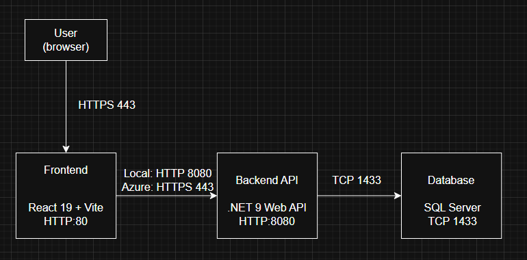

# Cloud Task Manager
Adam Demski 
Nr albumu - 94456

## Opis projektu
Aplikacja webowa do zarządzania zadaniami w architekturze 3-warstwowej.
Umożliwia tworzenie, edycję, usuwanie oraz przeglądanie zadań.
Projekt realizowany jako aplikacja cloud-native w Azure.

## Stos Technologiczny:
Warstwa        | Technologia             | Usługa Azure 

Frontend       | React 19 + Vite         | Azure Static Web Apps
Backend API    | .NET 9 Web API          | Azure App Service
Baza Danych    | SQL Server              | Azure SQL Database
Konteneryzacja | Docker & Docker Compose | Azure Container Registry
Sekrety        | .env / User Secrets     | Azure Key Vault  

## Diagram architektury

## Status projektu
- [x] Artefakt 1 – Architektura i struktura projektu
- [x] Artefakt 2 – Docker Compose i środowisko wielokontenerowe
- [x] Artefakt 3 - Działająca warstwa prezentacji